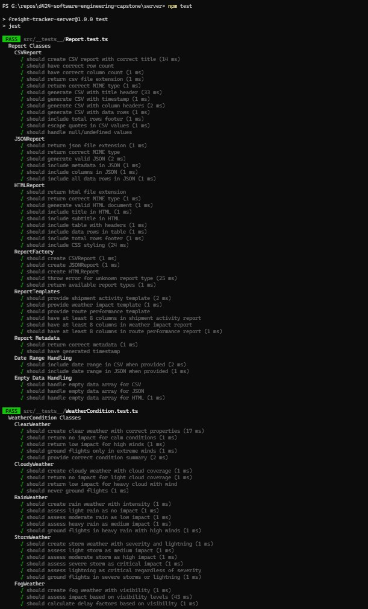
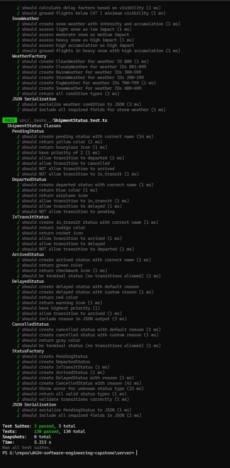

# Test Plan
## SkyTrack - Air Freight Tracking Platform

**Version:** 1.0  
**Date:** December 2025  
**Testing Framework:** Jest with ts-jest

---

## 1. Test Objectives

The unit testing strategy focuses on validating the core OOP classes that demonstrate:
- **Inheritance** - Subclasses properly extend parent classes
- **Polymorphism** - Abstract methods are correctly implemented by subclasses
- **Encapsulation** - Protected/private fields are accessible only through getters
- **Factory Pattern** - Factory classes create correct instances

---

## 2. Test Scope

| Test Suite | Class Under Test | Test Count | Purpose |
|------------|------------------|------------|---------|
| ShipmentStatus.test.ts | ShipmentStatus hierarchy | 47 tests | Validate status classes and transitions |
| WeatherCondition.test.ts | WeatherCondition hierarchy | 39 tests | Validate weather impact calculations |
| Report.test.ts | Report hierarchy | 44 tests | Validate report generation |

**Total Tests:** 130

---

## 3. Test Environment

| Component | Version |
|-----------|---------|
| Framework | Jest 29.7.0 |
| Language | TypeScript 5.3.3 |
| Transpiler | ts-jest 29.1.1 |
| Node | v24.2.0 |

---

## 4. Test Categories

### Category 1: Object Instantiation
Tests verify that objects are created with correct initial state.

**Example Tests:**
- `should create pending status with correct name`
- `should create clear weather with correct properties`
- `should create CSV report with correct title`

### Category 2: Method Behavior
Tests verify that methods return expected values based on inputs.

**Example Tests:**
- `should return yellow color` (for pending status)
- `should return no impact for calm conditions` (for clear weather)
- `should generate CSV with column headers`

### Category 3: State Transitions
Tests verify valid and invalid state transitions for shipment statuses.

**Example Tests:**
- `should allow transition to departed`
- `should NOT allow transition to arrived`
- `should be terminal status (no transitions allowed)`

### Category 4: Factory Pattern
Tests verify factories create correct class instances.

**Example Tests:**
- `should create PendingStatus`
- `should create ClearWeather for weather ID 800`
- `should create CSVReport`
- `should throw error for unknown status type`

### Category 5: Serialization
Tests verify objects serialize correctly to JSON for API responses.

**Example Tests:**
- `should serialize PendingStatus to JSON`
- `should include all required fields in JSON`
- `should generate valid JSON`

### Category 6: Edge Cases
Tests verify handling of null, undefined, and boundary values.

**Example Tests:**
- `should handle null/undefined values`
- `should escape quotes in CSV values`
- `should handle empty data array for CSV`

---

## 5. Test Execution Plan

### 5.1 Prerequisites
```bash
cd server
npm install
```

### 5.2 Test Commands

| Command | Purpose |
|---------|---------|
| `npm test` | Run all unit tests |
| `npm run test:coverage` | Run tests with coverage report |
| `npm run test:watch` | Run tests in watch mode (development) |

### 5.3 Expected Pass Criteria
- All 130 tests must pass
- No test failures or errors
- Coverage should be >70% for tested classes

---

## 6. Test File Locations

```
server/
├── src/
│   ├── __tests__/
│   │   ├── ShipmentStatus.test.ts    # 47 tests
│   │   ├── WeatherCondition.test.ts  # 39 tests
│   │   └── Report.test.ts            # 44 tests
│   └── classes/
│       ├── ShipmentStatus.ts         # Class under test
│       ├── WeatherCondition.ts       # Class under test
│       └── Report.ts                 # Class under test
├── jest.config.js                     # Jest configuration
└── package.json                       # Test scripts
```

---

## 7. Test Matrix

### 7.1 ShipmentStatus Tests (47 total)

| Test Suite | Test Case | Expected Result |
|------------|-----------|-----------------|
| PendingStatus | Create with correct name | `getStatusName()` returns "pending" |
| PendingStatus | Return yellow color | `getStatusColor()` returns "yellow" |
| PendingStatus | Return hourglass icon | `getStatusIcon()` returns "⏳" |
| PendingStatus | Have priority of 2 | `getPriority()` returns 2 |
| PendingStatus | Allow transition to departed | `canTransitionTo('departed')` returns true |
| PendingStatus | Allow transition to cancelled | `canTransitionTo('cancelled')` returns true |
| PendingStatus | NOT allow transition to arrived | `canTransitionTo('arrived')` returns false |
| PendingStatus | NOT allow transition to in_transit | `canTransitionTo('in_transit')` returns false |
| DepartedStatus | Create with correct name | `getStatusName()` returns "departed" |
| DepartedStatus | Return blue color | `getStatusColor()` returns "blue" |
| DepartedStatus | Allow transition to in_transit | `canTransitionTo('in_transit')` returns true |
| ArrivedStatus | Be terminal status | `canTransitionTo(any)` returns false |
| DelayedStatus | Include reason in JSON | JSON output contains reason field |
| StatusFactory | Create correct instances | Factory returns correct class type |
| StatusFactory | Throw for unknown type | Throws error for invalid input |

### 7.2 WeatherCondition Tests (39 total)

| Test Suite | Test Case | Expected Result |
|------------|-----------|-----------------|
| ClearWeather | No impact for calm conditions | `assessImpact()` returns "none" |
| ClearWeather | Low impact for high winds | `assessImpact()` returns "low" when wind > 15 |
| ClearWeather | Ground flights in extreme winds | `shouldGroundFlights()` returns true when wind > 25 |
| StormWeather | Critical impact for severe | `assessImpact()` returns "critical" |
| StormWeather | Critical with lightning | Lightning always returns "critical" |
| FogWeather | Impact based on visibility | Returns correct impact level for visibility ranges |
| WeatherFactory | Create from API data | Creates correct weather type from API ID |

### 7.3 Report Tests (44 total)

| Test Suite | Test Case | Expected Result |
|------------|-----------|-----------------|
| CSVReport | Generate with title | Output contains report title |
| CSVReport | Include column headers | Output contains all column headers |
| CSVReport | Escape quotes | Quotes in data are doubled |
| CSVReport | Handle null values | Null/undefined become empty strings |
| JSONReport | Generate valid JSON | Output parses without error |
| HTMLReport | Include table structure | Output contains table, thead, tbody |
| ReportFactory | Create correct type | Factory returns correct report class |
| ReportTemplates | Have 8+ columns | All templates have minimum 8 columns |

---

## 8. Screenshot Requirements

1. **Test Execution** - Terminal showing all 130 tests passing




2. **Coverage Report** - Coverage table showing percentage coverage


