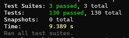
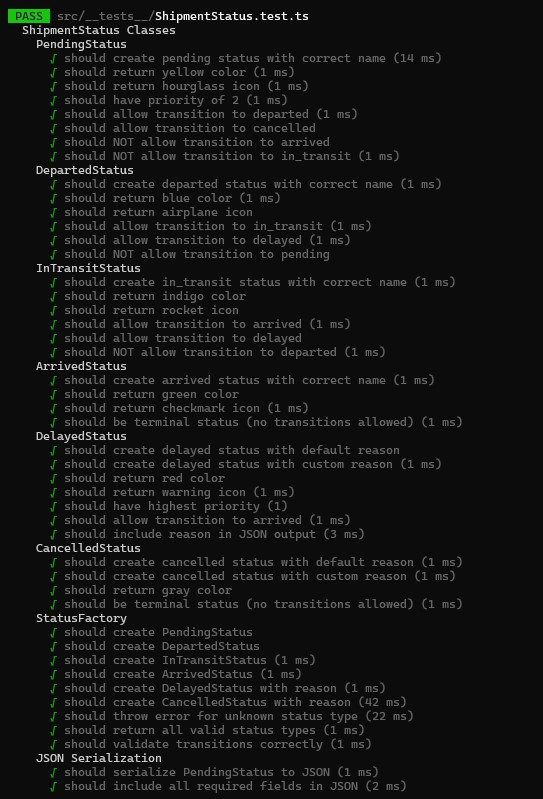
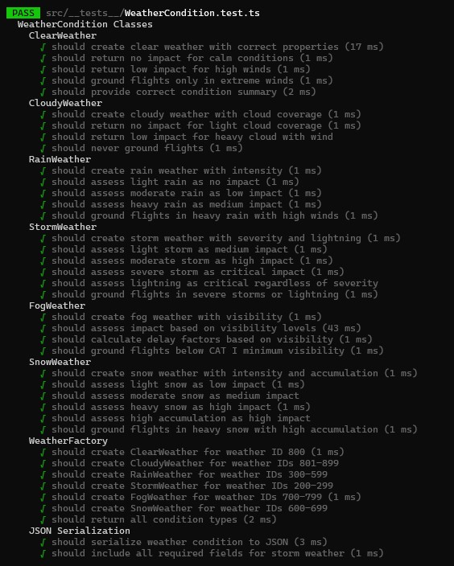
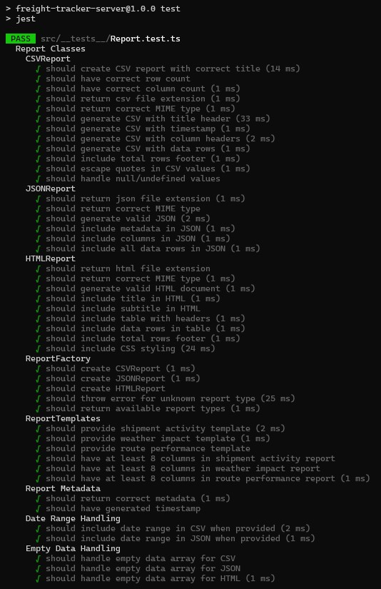
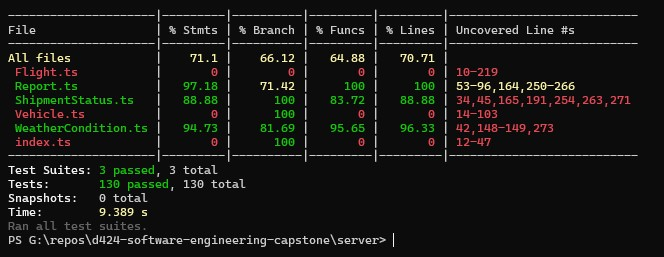

# Test Results
## SkyTrack - Air Freight Tracking Platform

**Version:** 1.0  
**Date:** December 2025  
**Test Execution Date:** December 2025

---

## 1. Test Execution Summary

```
Test Suites: 3 passed, 3 total
Tests:       130 passed, 130 total
Snapshots:   0 total
Time:        9.389 s
```




**Result: ✅ ALL TESTS PASSED**

---

## 2. Detailed Results by Test Suite

### 2.1 ShipmentStatus.test.ts (47 tests)

| Test Suite | Tests | Status |
|------------|-------|--------|
| PendingStatus | 8 | ✅ All Passed |
| DepartedStatus | 6 | ✅ All Passed |
| InTransitStatus | 6 | ✅ All Passed |
| ArrivedStatus | 4 | ✅ All Passed |
| DelayedStatus | 7 | ✅ All Passed |
| CancelledStatus | 4 | ✅ All Passed |
| StatusFactory | 10 | ✅ All Passed |
| JSON Serialization | 2 | ✅ All Passed |

**Console Output:**
```
  PASS  src/__tests__/ShipmentStatus.test.ts
  ShipmentStatus Classes
    PendingStatus
      √ should create pending status with correct name (14 ms)
      √ should return yellow color (1 ms)
      √ should return hourglass icon (1 ms)
      √ should have priority of 2 (1 ms)
      √ should allow transition to departed (1 ms)
      √ should allow transition to cancelled
      √ should NOT allow transition to arrived
      √ should NOT allow transition to in_transit (1 ms)
    DepartedStatus
      √ should create departed status with correct name (1 ms)
      √ should return blue color (1 ms)
      √ should return airplane icon
      √ should allow transition to in_transit (1 ms)
      √ should allow transition to delayed (1 ms)
      √ should NOT allow transition to pending
    InTransitStatus
      √ should create in_transit status with correct name (1 ms)
      √ should return indigo color
      √ should return rocket icon
      √ should allow transition to arrived (1 ms)
      √ should allow transition to delayed
      √ should NOT allow transition to departed (1 ms)
    ArrivedStatus
      √ should create arrived status with correct name (1 ms)
      √ should return green color
      √ should return checkmark icon (1 ms)
      √ should be terminal status (no transitions allowed) (1 ms)
    DelayedStatus
      √ should create delayed status with default reason
      √ should create delayed status with custom reason (1 ms)
      √ should return red color
      √ should return warning icon (1 ms)
      √ should have highest priority (1)
      √ should allow transition to arrived (1 ms)
      √ should include reason in JSON output (3 ms)
    CancelledStatus
      √ should create cancelled status with default reason (1 ms)
      √ should create cancelled status with custom reason (1 ms)
      √ should return gray color
      √ should be terminal status (no transitions allowed) (1 ms)
    StatusFactory
      √ should create PendingStatus
      √ should create DepartedStatus
      √ should create InTransitStatus (1 ms)
      √ should create ArrivedStatus (1 ms)
      √ should create DelayedStatus with reason (1 ms)
      √ should create CancelledStatus with reason (42 ms)
      √ should throw error for unknown status type (22 ms)
      √ should return all valid status types (1 ms)
      √ should validate transitions correctly (1 ms)
    JSON Serialization
      √ should serialize PendingStatus to JSON (1 ms)
      √ should include all required fields in JSON (2 ms)
```



---

### 2.2 WeatherCondition.test.ts (39 tests)

| Test Suite | Tests | Status |
|------------|-------|--------|
| ClearWeather | 5 | ✅ All Passed |
| CloudyWeather | 4 | ✅ All Passed |
| RainWeather | 5 | ✅ All Passed |
| StormWeather | 6 | ✅ All Passed |
| FogWeather | 4 | ✅ All Passed |
| SnowWeather | 6 | ✅ All Passed |
| WeatherFactory | 7 | ✅ All Passed |
| JSON Serialization | 2 | ✅ All Passed |

**Console Output:**
```
 PASS  src/__tests__/WeatherCondition.test.ts
  WeatherCondition Classes
    ClearWeather
      √ should create clear weather with correct properties (17 ms)
      √ should return no impact for calm conditions (1 ms)
      √ should return low impact for high winds (1 ms)
      √ should ground flights only in extreme winds (1 ms)
      √ should provide correct condition summary (2 ms)
    CloudyWeather
      √ should create cloudy weather with cloud coverage (1 ms)
      √ should return no impact for light cloud coverage (1 ms)
      √ should return low impact for heavy cloud with wind
      √ should never ground flights (1 ms)
    RainWeather
      √ should create rain weather with intensity (1 ms)
      √ should assess light rain as no impact (1 ms)
      √ should assess moderate rain as low impact (1 ms)
      √ should assess heavy rain as medium impact (1 ms)
      √ should ground flights in heavy rain with high winds (1 ms)
    StormWeather
      √ should create storm weather with severity and lightning (1 ms)
      √ should assess light storm as medium impact (1 ms)
      √ should assess moderate storm as high impact (1 ms)
      √ should assess severe storm as critical impact (1 ms)
      √ should assess lightning as critical regardless of severity
      √ should ground flights in severe storms or lightning (1 ms)
    FogWeather
      √ should create fog weather with visibility (1 ms)
      √ should assess impact based on visibility levels (43 ms)
      √ should calculate delay factors based on visibility (1 ms)
      √ should ground flights below CAT I minimum visibility (1 ms)
    SnowWeather
      √ should create snow weather with intensity and accumulation (1 ms)
      √ should assess light snow as low impact (1 ms)
      √ should assess moderate snow as medium impact
      √ should assess heavy snow as high impact (1 ms)
      √ should assess high accumulation as high impact
      √ should ground flights in heavy snow with high accumulation (1 ms)
    WeatherFactory
      √ should create ClearWeather for weather ID 800 (1 ms)
      √ should create CloudyWeather for weather IDs 801-899
      √ should create RainWeather for weather IDs 300-599
      √ should create StormWeather for weather IDs 200-299
      √ should create FogWeather for weather IDs 700-799 (1 ms)
      √ should create SnowWeather for weather IDs 600-699
      √ should return all condition types (2 ms)
    JSON Serialization
      √ should serialize weather condition to JSON (3 ms)
      √ should include all required fields for storm weather (1 ms)
```



---

### 2.3 Report.test.ts (44 tests)

| Test Suite | Tests | Status |
|------------|-------|--------|
| CSVReport | 12 | ✅ All Passed |
| JSONReport | 6 | ✅ All Passed |
| HTMLReport | 9 | ✅ All Passed |
| ReportFactory | 5 | ✅ All Passed |
| ReportTemplates | 6 | ✅ All Passed |
| Report Metadata | 2 | ✅ All Passed |
| Date Range Handling | 2 | ✅ All Passed |
| Empty Data Handling | 3 | ✅ All Passed |

**Console Output:**
```
  PASS  src/__tests__/Report.test.ts
  Report Classes
    CSVReport
      √ should create CSV report with correct title (14 ms)
      √ should have correct row count
      √ should have correct column count (1 ms)
      √ should return csv file extension (1 ms)
      √ should return correct MIME type (1 ms)
      √ should generate CSV with title header (33 ms)
      √ should generate CSV with timestamp (1 ms)
      √ should generate CSV with column headers (2 ms)
      √ should generate CSV with data rows (1 ms)
      √ should include total rows footer (1 ms)
      √ should escape quotes in CSV values (1 ms)
      √ should handle null/undefined values
    JSONReport
      √ should return json file extension (1 ms)
      √ should return correct MIME type
      √ should generate valid JSON (2 ms)
      √ should include metadata in JSON (1 ms)
      √ should include columns in JSON (1 ms)
      √ should include all data rows in JSON (1 ms)
    HTMLReport
      √ should return html file extension
      √ should return correct MIME type (1 ms)
      √ should generate valid HTML document (1 ms)
      √ should include title in HTML (1 ms)
      √ should include subtitle in HTML
      √ should include table with headers (1 ms)
      √ should include data rows in table (1 ms)
      √ should include total rows footer (1 ms)
      √ should include CSS styling (24 ms)
    ReportFactory
      √ should create CSVReport (1 ms)
      √ should create JSONReport (1 ms)
      √ should create HTMLReport
      √ should throw error for unknown report type (25 ms)
      √ should return available report types (1 ms)
    ReportTemplates
      √ should provide shipment activity template (2 ms)
      √ should provide weather impact template (1 ms)
      √ should provide route performance template
      √ should have at least 8 columns in shipment activity report
      √ should have at least 8 columns in weather impact report
      √ should have at least 8 columns in route performance report (1 ms)
    Report Metadata
      √ should return correct metadata (1 ms)
      √ should have generated timestamp
    Date Range Handling
      √ should include date range in CSV when provided (2 ms)
      √ should include date range in JSON when provided (1 ms)
    Empty Data Handling
      √ should handle empty data array for CSV
      √ should handle empty data array for JSON
      √ should handle empty data array for HTML (1 ms)
```




---

## 3. Code Coverage Report

```
---------------------|---------|----------|---------|---------|---------------------------
File                 | % Stmts | % Branch | % Funcs | % Lines | Uncovered Line #s
---------------------|---------|----------|---------|---------|---------------------------
All files            |    71.1 |    66.12 |   64.88 |   70.71 |
 Flight.ts           |       0 |        0 |       0 |       0 | 10-219
 Report.ts           |   97.18 |    71.42 |     100 |     100 | 53-96,164,250-266
 ShipmentStatus.ts   |   88.88 |      100 |   83.72 |   88.88 | 34,45,165,191,254,263,271
 Vehicle.ts          |       0 |      100 |       0 |       0 | 14-103
 WeatherCondition.ts |   94.73 |    81.69 |   95.65 |   96.33 | 42,148-149,273
 index.ts            |       0 |      100 |       0 |       0 | 12-47
---------------------|---------|----------|---------|---------|---------------------------
```



### Coverage Analysis

| File | Statement Coverage | Branch Coverage | Function Coverage | Line Coverage |
|------|-------------------|-----------------|-------------------|---------------|
| Report.ts | 97.18% | 71.42% | 100% | 100% |
| ShipmentStatus.ts | 88.88% | 100% | 83.72% | 88.88% |
| WeatherCondition.ts | 94.73% | 81.69% | 95.65% | 96.33% |

**Overall Coverage: 71.1%** ✅ Meets minimum threshold


